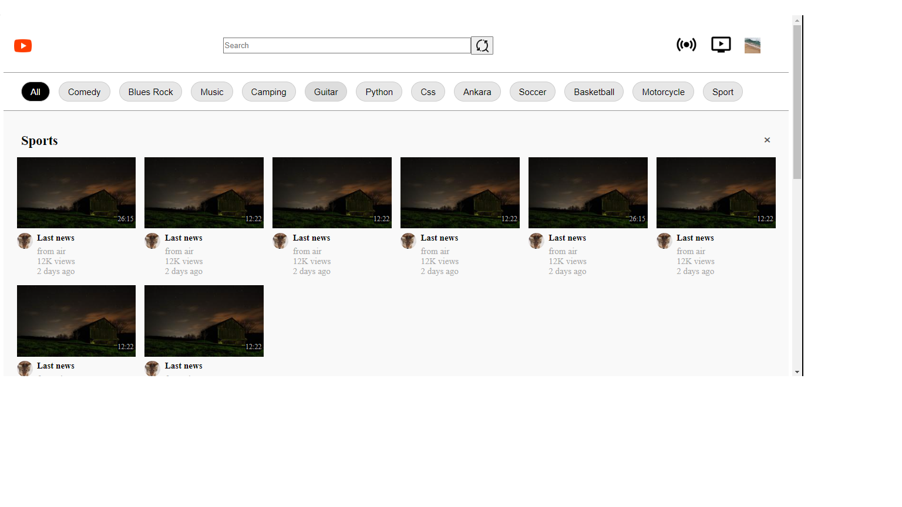

# YouTube-Design-Clone

## Hello everyone,This project is about creating a youtube clon page by using html-css. I learned that from WebDevSimplified youtube channel and now I will share some point from my view.

#### There are some basic steps I want to share, to create it easier.
#### We will create one article for one video, this article will include:
    -video photo, 
    -time duration, 
    -Channel name
    -Video title
    -Data about views and upload day
#### Those articles(videos) will create section which is video category so we can split them with a line.Top of each category there will be topic name and close button.
#### Top of our page will include;
    -icon 
    -form(search bar) 
    -div(other icons)
    

    

  
